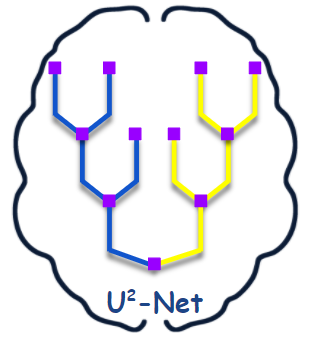
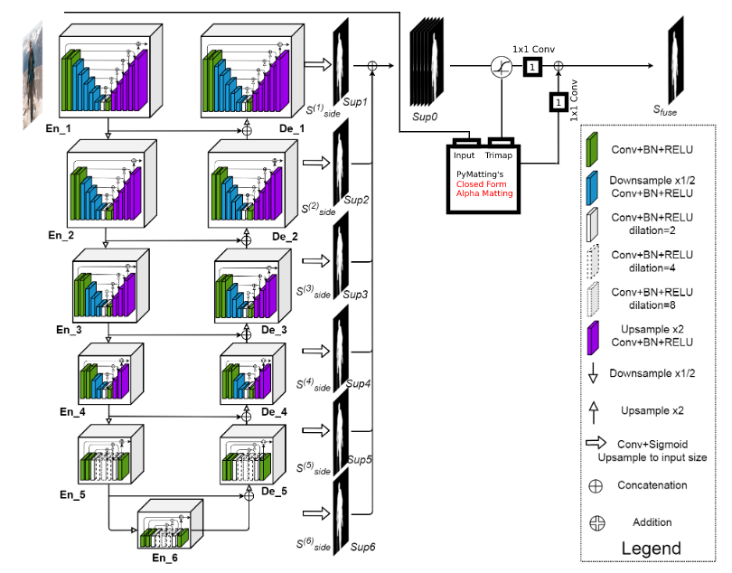
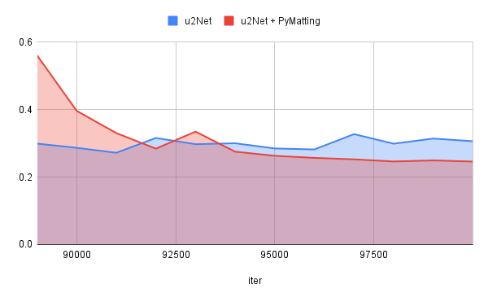

<p align="center">
  
  
  <h1 align="center">U<sup>2</sup>-Net: U Square Net</h1>
    
</p>

## Description:
Improving u2Net performance using classical alpha metting techniques.

## BaseCode: 
pymatting: https://github.com/pymatting/pymatting
u2Net: https://github.com/xuebinqin/U-2-Net/blob/master/u2net_train.py


## Setup:

1. Install All the Dependencies ( its recommended to create a new env.)
```
pip install -r requirements.txt
```
2. Download DUTS Dataset from .

3. Put DUTS-TR inside `train_data/DUTS/`

4. you can also download the pretrained models from  and put it inside `saved_models` folder

5. run the training script:

```
python u2net_train.py
```


## Architecture:



## Results:


